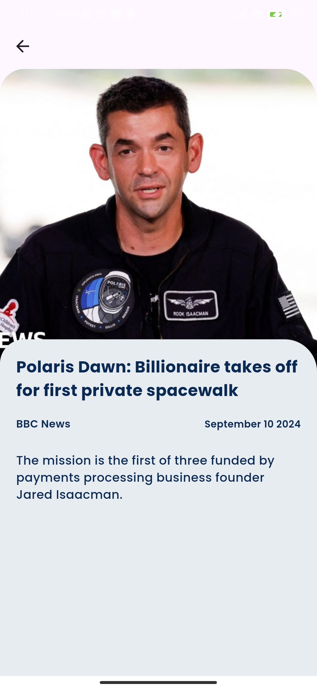

# Flutter News App

## Overview

This Flutter News App allows users to fetch and view news articles from a public news API. The app features a search functionality, a theme change option, and a user-friendly interface. It is built using Flutter and follows the MVVM (Model-View-ViewModel) architecture with Provider for state management.

## Features

- **News Feed**: Displays a list of news articles fetched from a public news API.
- **Search Functionality**: Allows users to search for news articles by keyword.
- **Theme Change**: Users can switch between light and dark themes using the DayNightSwitch.
- **Responsive Design**: The app is designed to be responsive and user-friendly on different screen sizes.

## Installation

To run this app locally, follow these steps:

1. **Clone the Repository**

    ```bash
    git clone https://github.com/Prajwalu-13/news_app.git
    ```

2. **Navigate to the Project Directory**

    ```bash
    cd news_app
    ```

3. **Install Dependencies**

   Make sure you have Flutter installed. Run the following command to install the necessary dependencies:

    ```bash
    flutter pub get
    ```

4. **Run the App**

   Connect your device or start an emulator, then run:

    ```bash
    flutter run
    ```

## Dependencies

This project uses the following dependencies:

- `cupertino_icons: ^1.0.2`
- `http`
- `provider`
- `cached_network_image`
- `flutter_spinkit`
- `google_fonts: ^6.2.1`
- `intl`
- `flashy_tab_bar2`
- `anim_search_bar`
- `animated_theme_switcher`

## Architecture

The app follows the MVVM (Model-View-ViewModel) architecture:

- **Model**: Contains data models and business logic.
- **View**: Defines the UI components and layout.
- **ViewModel**: Manages the state and interacts with the model to update the view.

## Design Patterns

- **Provider**: Used for state management to handle UI updates based on changes in the data.
- **MVVM Architecture**: Separates the UI from the business logic, making the app more maintainable and testable.

## Third-Party Libraries

- **http**: For making network requests.
- **cached_network_image**: To cache images and improve performance.
- **flutter_spinkit**: Provides loading animations.
- **google_fonts**: To use custom fonts.
- **flashy_tab_bar2**: A customizable tab bar widget.
- **anim_search_bar**: A search bar widget with animations.
- **animated_theme_switcher**: A widget to switch themes with animations.

## Screenshots

### Home Screen

<p align="center">
  
  
  
</p>
*Home Screen and Home Screen Data*

  
*Search Functionality*

  
*Theme Change*

## License

This project is licensed under the MIT License - see the [LICENSE](LICENSE) file for details.
